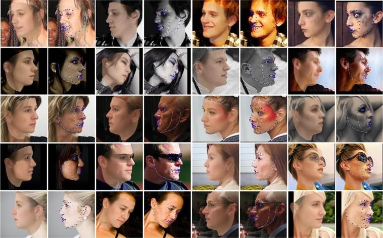
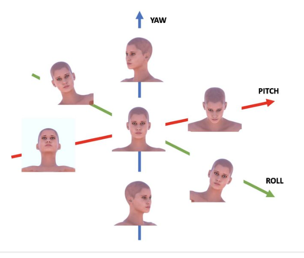
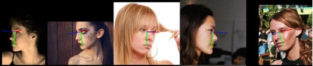

# Head-Pose-Estimation

## AFLW2000

AFLW2000-3D is a dataset of 2000 images. This dataset is used for evaluation of 3D facial landmark detection models. The head poses are very diverse and often hard to be detected by a CNN-based face detector.

## YAW, PITCH, ROLL

The head rotations movements represented in yaw, pitch and roll angles.

