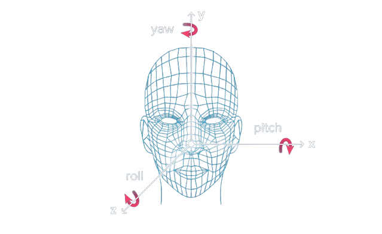
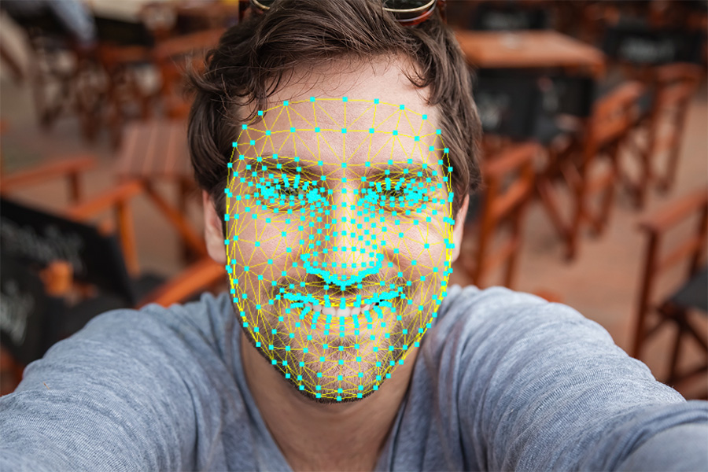
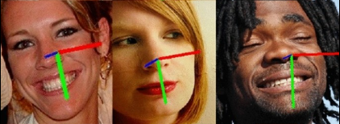

# Head-Pose-Estimation

The main objective of this project is to find the relative orientation (and position) of the human’s head with respect to the camera using Machine Learning and MediaPipe on AFLW2000.
In particular, in the head pose estimation task, it is common to predict relative orientation with yaw, pitch and roll. They define the object’s rotation in a 3D environment.

## AFLW2000

AFLW2000-3D is a dataset of 2000 images. This dataset is used for evaluation of 3D facial landmark detection models. The head poses are very diverse and often hard to be detected by a CNN-based face detector.

## MediaPipe Face Mesh
MediaPipe Face Mesh is a solution that estimates 468 3D face landmarks in real-time

## Solution HeadPose

## Requirements
- Sklearn
- CV2
- MediaPipe
